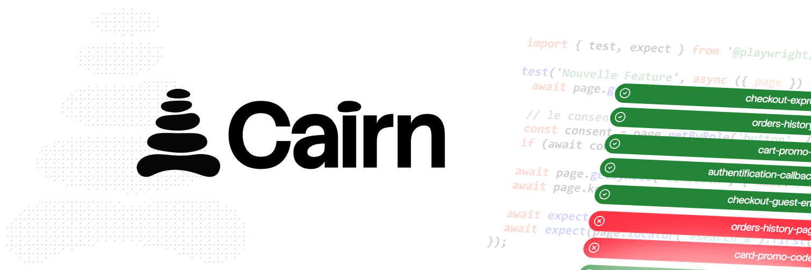

# Cairn

<p align="center">
  
</p>

**A registry of proven feature intentions.**

A codebase remembers what it *does*. Nothing remembers what it was *promised to
do*. Cairn is that memory: a plain-text registry, committed next to your code.
Every feature is one **stone** carrying the user's own words, and one
deterministic Playwright **proof** that the promise is still kept — replayed by
CI forever, with no model in the loop.

```
.cairn/
├── stones/01KZ4XGH….md      the promise, in the user's language
└── proofs/01KZ4XGH….spec.ts the evidence, replayed by CI forever
```

Three agents run the loop: the **mason** turns a request into draft stones (and
refuses anything a user cannot observe), the **warden** writes the proof without
ever reading the source code, and **triage** decides whether a red proof is a
regression or a legitimate change of intent. Once a proof is green it is frozen:
a proven stone may never regress.

## Quickstart

```sh
pnpm add -D @usecairn/cli          # in the project whose features you are registering
pnpm exec cairn init            # .cairn/{stones,proofs} + cairn.config.ts
```

> Nothing is published to npm yet. Until it is, depend on the workspace from a
> checkout: `pnpm add -D file:../cairn/packages/cli`.

```sh
cairn add --title "…" --acceptance "…" --request "…" --proof   # raise a stone
cairn verify                                                   # run the proofs
cairn status                                                   # where the cairn stands
```

Full walkthrough of one feature, from a sentence to a proven stone:
**[docs/first-session.md](docs/first-session.md)**.

## Agent skills — Claude, Codex, Cursor

The mason, warden and triage skills ship for three agents, from a single source:

- **Claude Code** — [`.claude/skills/`](.claude/skills)
- **Codex** — [`.codex/skills/`](.codex/skills)
- **Cursor** — [`.cursor/rules/`](.cursor/rules)

They belong in the *target* project (the app whose features you register); they
live here to be versioned with the CLI they call. [`AGENTS.md`](AGENTS.md)
points any other agent at the same instructions; how the mirrors are kept in
sync (and checked) is in [docs/agent-mirrors.md](docs/agent-mirrors.md).

## Documentation

- **[Technical overview](docs/technical.md)** — why it is not just "write
  tests", the stone lifecycle, the monorepo layout, the MCP server, the Phase 6
  metrics.
- **[First session](docs/first-session.md)** — one feature, end to end.
- **[Orchestration](docs/orchestration.md)** — the loop and the permission model
  that keeps the warden blind.
- **[CI](docs/ci.md)** — the red-pipeline protocol and the ratchet.

## Development

Node 22, pnpm 10, TypeScript ESM strict.

```sh
pnpm install
pnpm -r build      # build core and cli first: cli resolves core through its dist types
pnpm -r typecheck
pnpm -r test
```

## License

[MIT](LICENSE).
