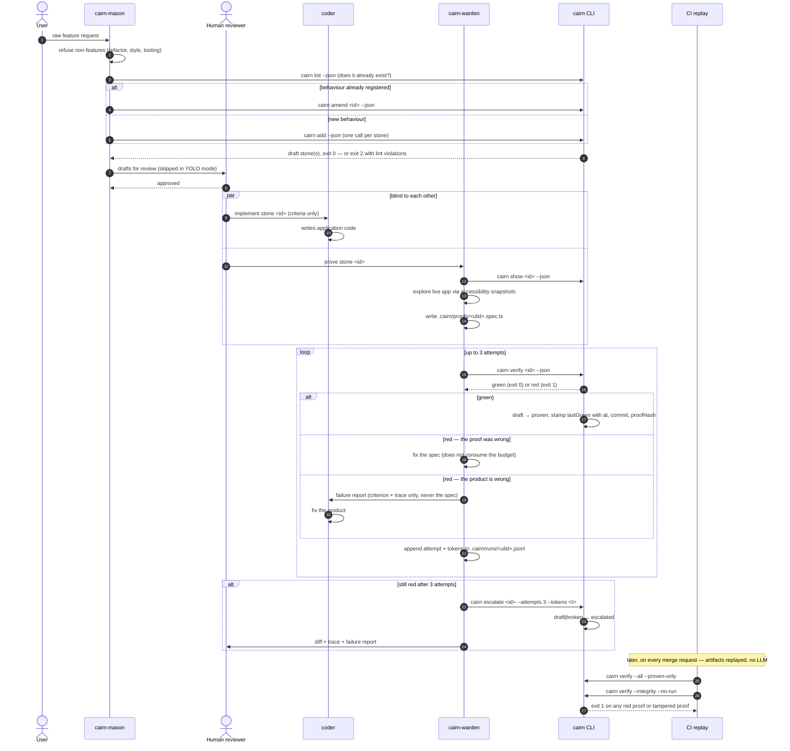

# Orchestration

How the three Cairn agents fit together, who is allowed to read and write what,
and how the loop is kept honest.

The vocabulary is fixed: the **cairn** is the registry in `.cairn/` of a target
project, a **stone** is one feature, a **proof** is the deterministic Playwright
spec that proves it. Proofs are artifacts — CI replays them with no model in the
loop.

---

## 1. The loop, end to end

```
user request
     │
     ▼
┌──────────────┐
│ cairn-mason  │  extracts 0..n draft stones  ──►  refuses non-features outright
└──────┬───────┘
       │  draft stones (status: draft, proof path declared, proof file absent)
       ▼
┌──────────────────────┐
│ human review         │  recommended; skippable in YOLO mode
│ of the drafts        │  the only cheap moment to fix a wrong promise
└──────┬───────────────┘
       │  approved drafts
       ├────────────────────────────┐
       ▼                            ▼
┌──────────────┐            ┌──────────────┐
│ coder        │            │ cairn-warden │   in parallel, and blind to each other
│ writes code  │            │ writes proof │
│ never sees   │            │ never sees   │
│ the proof    │            │ the code     │
└──────┬───────┘            └──────┬───────┘
       │                           │
       └──────────►  cairn verify <id>  ◄──────┘
                            │
              ┌─────────────┴─────────────┐
              ▼                           ▼
           green                        red
              │                           │
              ▼                    ┌──────┴───────┐
        status: proven             │ warden judges│
        lastGreen stamped          │ proof wrong? │
        (time, commit, sha256)     │ product wrong│
                                   └──────┬───────┘
                                          │
                       proof wrong ───────┤─────── product wrong
                       warden fixes it    │        failure report → coder
                       (free, no budget)  │        (attempt n of 3)
                                          │
                                    after 3 attempts
                                          ▼
                                  cairn escalate <id>
                                  status: escalated
                                  human gets diff + trace + report
```

Two properties make this more than a normal test loop:

- **The warden is blind to the code.** Its proof is written from the intent and
  the running app, so a green proof is evidence about the product, not a mirror
  of the implementation.
- **The coder is blind to the proof.** It receives only the unsatisfied
  criterion and a trace, so it writes code that satisfies the user rather than
  code that satisfies an assertion.

Both blindnesses are enforced mechanically (section 3), because both are
irresistible to a model that is trying to be helpful.

### Human review of the drafts

Recommended, and cheap: a wrong promise caught at draft time costs one sentence;
caught after the warden proved it, it costs an amendment, a retired stone and a
rewritten proof. In YOLO mode the review is skipped and the drafts go straight to
the warden — acceptable for a solo project, never for a shared one.

The human is checking three things, in this order:

1. **Granularity** — is each stone one scenario? (Too coarse is the common error.)
2. **Truth** — does the criterion say what the user actually asked for?
3. **Provability** — could someone with no access to the code check this in a
   browser?

### The rounds, and the budget

| Round | Who acts | Costs a budget attempt? |
|---|---|---|
| Warden drives the app wrongly (bad name, wrong entry point, a race) | warden fixes its own spec | **No** — the proof was wrong, not the product |
| Product does not keep the promise | failure report → coder → fix → re-verify | **Yes** |
| Third round still red | `cairn escalate <id>` | budget exhausted |

`N = 3` is frozen. After the third red, no fourth attempt is taken — the stone
goes to `escalated`, the only status a verify run will never move, and a human
arbitrates with the diff, the trace and the report.

---

## 2. Sequence diagram



---

## 3. Permission enforcement

Two blindnesses to enforce, plus one ownership rule:

| Actor | Must not | Must be able to |
|---|---|---|
| **coder** | write anything under `.cairn/`; **read** `.cairn/proofs/**` | read `.cairn/stones/**` (the criteria are the brief) |
| **cairn-warden** | read application source | read `.cairn/**`, `cairn.config.ts`, `playwright.config.*`; write `.cairn/proofs/**` and `.cairn/runs/**` |
| **cairn-mason** | write `.cairn/proofs/**`; run `cairn verify` | run `cairn add` / `amend` / `list` / `show` |

> **Ownership.** Apart from `cairn add` / `cairn amend` — the mason's only writes,
> and they go through the CLI, never through a file editor — **the warden is the
> sole writer of `.cairn/`**. Every status transition in the registry is the
> result of a `cairn verify` or a `cairn escalate` run by the warden. Nothing
> else may touch stones or proofs.

### 3.1 Coder session — `.claude/settings.json`

Drop this in the project the coder works in (or in the coder subagent's own
settings). `deny` always wins over `allow`.

```json
{
  "permissions": {
    "deny": [
      "Write(./.cairn/**)",
      "Edit(./.cairn/**)",
      "Read(./.cairn/proofs/**)",
      "Bash(rm:*.cairn*)",
      "Bash(cairn verify:*)",
      "Bash(cairn escalate:*)",
      "Bash(cairn add:*)",
      "Bash(cairn amend:*)"
    ],
    "allow": [
      "Read(./.cairn/stones/**)",
      "Bash(cairn list:*)",
      "Bash(cairn show:*)",
      "Bash(cairn status:*)"
    ]
  }
}
```

Why `Read(./.cairn/proofs/**)` is denied and not merely discouraged: a coder that
reads the spec will satisfy the assertion instead of the promise, and the proof
silently stops being evidence. This is the single most valuable deny rule in the
whole system.

The coder *is* given `Read(./.cairn/stones/**)`: the acceptance criteria are the
brief. Hiding them would just make the coder guess.

### 3.2 Warden subagent — `.claude/settings.json`

```json
{
  "permissions": {
    "deny": [
      "Read(./src/**)",
      "Read(./app/**)",
      "Read(./pages/**)",
      "Read(./components/**)",
      "Read(./lib/**)",
      "Read(./server/**)",
      "Read(./api/**)",
      "Read(./prisma/**)",
      "Edit(./src/**)",
      "Write(./src/**)",
      "Bash(git diff:*)",
      "Bash(git show:*)",
      "Bash(git log:*)",
      "Bash(cat:*)",
      "Bash(head:*)",
      "Bash(tail:*)",
      "Bash(grep:*)",
      "Bash(rg:*)",
      "Bash(sed:*)",
      "Bash(awk:*)"
    ],
    "allow": [
      "Read(./.cairn/**)",
      "Read(./cairn.config.ts)",
      "Read(./playwright.config.ts)",
      "Read(./playwright.config.js)",
      "Write(./.cairn/proofs/**)",
      "Edit(./.cairn/proofs/**)",
      "Write(./.cairn/runs/**)",
      "Bash(cairn:*)",
      "Bash(pnpm exec playwright:*)",
      "Bash(npx playwright:*)"
    ]
  }
}
```

Note the shell rules. Denying `Read(./src/**)` alone is theatre: `cat src/app.tsx`
is a Bash call, and `Grep`/`Glob` return file content too. For the warden the
`Bash` surface must be an **allowlist** of `cairn` and `playwright` invocations,
with the file-reading utilities explicitly denied. Adjust the source globs to the
target project's actual layout — the list above is a starting point, not a
universal truth.

**Strongest form.** If the orchestrator can afford it, run the warden in a
worktree or container that simply **does not contain the application source** —
only `.cairn/`, `cairn.config.ts`, `playwright.config.*` and `node_modules`. A
file that is not there cannot be read by any tool, allowlist or not. Permission
rules are the fast default; absence is the guarantee.

### 3.3 Filesystem permissions — the belt to the braces

Permission rules live inside the agent harness; file modes live under it. Run the
coder and the warden as different OS users and let the kernel enforce the rest:

```bash
# The warden owns the cairn.
chown -R warden:cairn .cairn
chmod -R u=rwX,g=rX,o= .cairn        # nobody outside the cairn group reads it
chmod -R u=rwX,g=,o= .cairn/proofs   # only the warden reads or writes the proofs
chmod  u=rwX,g=rX,o= .cairn/stones   # the coder's group may read the criteria

# The coder runs as a user in the `cairn` group but not as `warden`.
# Result: `cairn add`/`amend` still work (they run as the mason),
# `cairn verify` writes stones only when run as the warden,
# and any attempt by the coder to touch a proof fails with EACCES.
```

A denied tool call is a model choosing to comply. An `EACCES` is not a choice.

### 3.4 Subagent definitions

Each skill is paired with a subagent so the permission profile travels with the
role rather than with the session:

```markdown
---
name: cairn-warden
description: Writes and greens the proof for a stone, blind to application source.
tools: Bash, Read, Write, Edit, Glob
model: inherit
---

Follow .claude/skills/cairn-warden/SKILL.md exactly. You never read application
source code.
```

`tools:` removes `Grep` from the warden entirely — one fewer way to read source.
The coder subagent keeps `Grep` (it needs it) and relies on the path denies plus
the file modes above.

---

## 4. Anti-cheat: the integrity audit

A proof is an artifact. Once a stone is `proven`, `lastGreen.proofHash` holds the
sha256 of the exact proof file that was green (computed over LF-normalised,
BOM-stripped content, so a Windows checkout does not invalidate the cairn).

The cheat this defends against is not exotic: an agent under pressure to turn a
red green edits the spec until it passes. The audit makes that visible, because
the hash on the stone no longer matches the file on disk.

```bash
cairn verify --integrity --no-run
```

`--no-run` skips Playwright entirely: this is a **pure audit**, cheap enough to
run on every session end and every CI job. Exit `1` on any mismatch.

### Post-session hook — `.claude/settings.json`

```json
{
  "hooks": {
    "Stop": [
      {
        "matcher": "",
        "hooks": [
          {
            "type": "command",
            "command": "cairn verify --integrity --no-run",
            "timeout": 60
          }
        ]
      }
    ],
    "SubagentStop": [
      {
        "matcher": "",
        "hooks": [
          {
            "type": "command",
            "command": "cairn verify --integrity --no-run",
            "timeout": 60
          }
        ]
      }
    ],
    "SessionEnd": [
      {
        "matcher": "",
        "hooks": [
          {
            "type": "command",
            "command": "cairn verify --integrity --no-run --json",
            "timeout": 60
          }
        ]
      }
    ]
  }
}
```

`SubagentStop` is the one that matters most: it fires the moment the coder
subagent finishes, so a proof edited during that turn is caught before the work
is handed back — not three sessions later.

A mismatch is never "fix the hash". It means one of two things:

- the warden legitimately reworked the proof → re-run `cairn verify <id>`, which
  re-stamps the hash from a genuine green run;
- somebody else edited the proof → that is tampering. `cairn-triage` returns the
  `TAMPERED` verdict and it goes to a human with the diff of the proof file.

The same command belongs in CI, next to the ratchet:

```yaml
- run: cairn verify --all --proven-only     # every proven stone must still be green
- run: cairn verify --integrity --no-run    # and must still be the same proof
```

The pipeline itself, the exit-code table and the "red at 18:40" runbook live in
[`docs/ci.md`](./ci.md); this section only states where the two commands sit in
the agent loop.

`--proven-only` is the ratchet: drafts are allowed to be red (they are not proven
yet), but nothing that was ever proven may regress. CI replays the artifacts with
no model involved — that is what makes the guarantee cheap enough to run on every
push.

---

## 5. Instrumentation: attempts and tokens

**Every warden run logs its attempt count and token cost.** Not optionally.

### What is written where

During the loop, one JSONL line per attempt in `.cairn/runs/<ulid>.jsonl` —
git-ignored by `.cairn/.gitignore`, because it is run output, not registry:

```json
{"at":"2026-08-03T22:57:12.536Z","stone":"01KZ4XGHGEXZ0DPYTA22QYVDHF","attempt":2,"actor":"coder","result":"red","criterion":"after emptying the cart, the cart page shows no article and a total of 0 €","tokens":41200,"proofEdited":false}
```

At the two moments the number becomes durable, it is written into the stone's
`provenance`, which **is** committed:

```bash
# budget exhausted — the counters land in provenance.attempts / provenance.tokens
cairn escalate <id> --attempts 3 --tokens 187000
```

```jsonc
// carried forward across an amendment, otherwise the cost dies with the retired stone
{ "acceptance": ["…"], "provenance": { "request": "…", "attempts": 3, "tokens": 187000 }, "proof": true }
```

In Phase 1, `cairn verify` does not itself write `provenance.attempts` on a green
run: the JSONL is the running ledger, and `escalate` / `amend` are where the
number becomes part of the registry. Any future automation of this must not
change the semantics — attempts are a property of the *stone's history*, not of a
single run.

### Why this is the metric that decides everything

`N = 3` is not a safety valve, it is **the unit economics of the product**.

The cost of a proven stone is
`tokens(mason) + tokens(warden × attempts) + tokens(coder × rounds)`.
The value of a proven stone is a regression that will never ship again, replayed
by CI for free forever. The whole bet is that the second number beats the first.

The distribution of `attempts` is what tells you whether the bet holds:

- **Median 1** — the loop pays for itself; consider raising `N` so fewer stones
  escalate.
- **Median 3, mostly escalating** — the loop is a token furnace. The fix is
  almost never a bigger budget; it is better acceptance criteria upstream. That
  is a mason problem, and it is only visible because attempts were logged.
- **Attempts high on one surface only** — that surface is under-specified or
  genuinely hard to drive; a fixture is probably missing from `setup`.
- **`proofEdited: true` dominating** — the warden is fighting the app, not the
  product: exploration is too shallow, or accessible names are missing (which is
  itself a real defect worth a stone).

Without this ledger, `N = 3` is a number somebody liked. With it, `N` is a
tuning knob backed by evidence, and the cost per proven stone is a figure you can
put next to the cost of a human writing the same test — which is the only
comparison that decides whether any of this was worth building.
