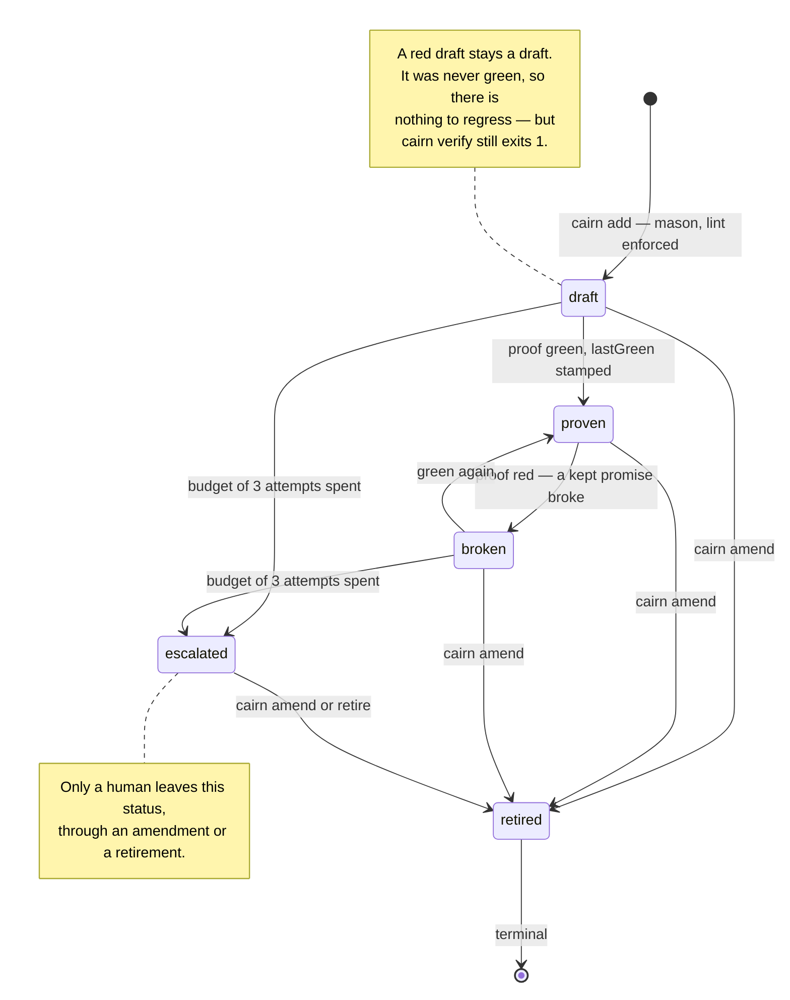

# Cairn — technical overview

The long version of the [README](../README.md): why the design is what it is,
the stone lifecycle, the monorepo layout, the MCP server, and the metrics that
will decide Phase 6.

The registry is called the **cairn** and lives in `.cairn/`. A **stone** is one
feature. A **proof** is the spec that proves it. Three words, no others.

```
.cairn/
├── stones/01KZ4XGH….md      the promise, in the user's language
└── proofs/01KZ4XGH….spec.ts the evidence, replayed by CI forever
```

## Why it is not just "write tests"

Two separations do all the work, and both are enforced mechanically rather than
asked for politely.

**The mason and the warden are different agents.** `cairn-mason` turns a raw
request into draft stones and refuses anything that is not user-observable — a
refactor produces zero stones, and that is a correct outcome. `cairn-warden` then
writes the proof. Acceptance criteria are user language by construction: the CLI
lints them and refuses CSS selectors, HTTP routes, camelCase identifiers, file
paths and function calls, with exit code `2`. You cannot register *"`clearCart()`
empties the cart"*. You can register *"emptying the cart from the cart page leaves
it with no article"*.

**The warden is blind to the code.** It never reads the source, the diff, or the
commit message. It works from the intent, the criteria, and the running app in a
browser. A proof written from the code proves the code does what the code does —
a tautology. A proof written from the intent proves the product does what the
user was promised. And the coder never sees the proof either: it receives the
unsatisfied criterion and a trace, so it writes code that satisfies a user rather
than code that satisfies an assertion.

**The proof is an artifact, not a conversation.** Once green, the spec file is
frozen and its sha256 is stamped on the stone. CI replays it with **no model in
the loop**: `cairn verify --all --proven-only` is a ratchet — drafts may be red,
but nothing that was ever proven may regress. `cairn verify --integrity --no-run`
is a pure audit that catches an agent editing a spec until it passes. The cost of
the guarantee, on every push, is the cost of running Playwright.

> **Honest scope, v1.** Proofs are Playwright specs driving a **web app in a
> browser**. If your feature is a CLI, a cron job, a queue consumer or a native
> app, Cairn has nothing to prove it with yet. The registry, the lint, the
> lifecycle and the CI ratchet are all runner-agnostic; only the proof format is
> not. That is a real limit, not a roadmap flourish.

## The stone lifecycle



Stones are **amended, never edited**. An amendment raises a new draft that points
back at the old stone through `amends`; the old one retires with `amendedBy` set.
The lineage of *why* survives every change, which is the whole reason the verbatim
user request is stored on the stone.

## Working with the CLI

Set `baseURL`, `start` and (if your proofs need a seeded state) `setup` in
`cairn.config.ts`. Then raise a stone:

```sh
cairn add \
  --title "Empty the cart from the cart page" \
  --acceptance "after emptying the cart, the cart page shows no article and a total of 0 €" \
  --request "je veux pouvoir vider mon panier, c'est pénible de supprimer les articles un par un" \
  --proof
```

`--proof` declares where the proof will live (`.cairn/proofs/<ulid>.spec.ts`).
Agents use `--json` instead and pipe a full payload on stdin; every read command
has `--json` too.

The warden writes that spec against the running app. Then:

```sh
cairn verify                       # run every active stone's proof, fold results back
cairn verify --all --proven-only   # the CI ratchet: no proven stone may regress
cairn verify --integrity --no-run  # the pure tamper audit, no Playwright at all
cairn status                       # counts, drafts awaiting proof, broken, escalated
```

Exit codes are a contract: **`0`** all good · **`1`** the cairn is unhappy (a red
proof, an integrity mismatch) · **`2`** refused (the acceptance lint said no, or
bad usage). CI only ever needs to read the number.

Full walkthrough of one feature, end to end, with the mason/warden loop:
**[first-session.md](first-session.md)**.

## The monorepo

| Path | What it is |
| --- | --- |
| [`packages/core`](../packages/core) | `@cairn/core` — the domain. Stone schema (Zod), frontmatter files, the acceptance lint, the frozen state machine, proof integrity hashing. No I/O policy, no CLI. |
| [`packages/cli`](../packages/cli) | `@cairn/cli` — the `cairn` command: `init`, `add`, `amend`, `list`, `show`, `status`, `escalate`, `verify`. Everything is exported, so other surfaces call the same code paths instead of scraping output. |
| [`packages/mcp`](../packages/mcp) | `@cairn/mcp` — the cairn over MCP (stdio), eight frozen tools and three `cairn://` resources. The acceptance guard-rail is enforced server-side; there is no `force`. |
| [`apps/desktop`](../apps/desktop) | `cairn-desktop` — the Tauri 2 + React review app: read the stones, review the drafts, watch the proofs. Runs in a plain browser against a demo cairn with no Rust and no repository. |
| [`.claude/skills`](../.claude/skills) | The three agent skills: [`cairn-mason`](../.claude/skills/cairn-mason/SKILL.md), [`cairn-warden`](../.claude/skills/cairn-warden/SKILL.md), [`cairn-triage`](../.claude/skills/cairn-triage/SKILL.md). Mirrored for Codex ([`.codex/skills`](../.codex/skills)) and Cursor ([`.cursor/rules`](../.cursor/rules)). They belong in the *target* project; they live here to be versioned with the CLI they call. |
| [`docs/orchestration.md`](orchestration.md) | The loop, the permission model that makes both blindnesses real (deny rules, subagent tools, OS file modes), the integrity hook. |
| [`docs/ci.md`](ci.md) | The red-pipeline protocol, written to be read in anger at 18:40. Exit codes, flakiness policy, the triage runbook. |
| [`docs/first-session.md`](first-session.md) | One feature from a sentence to a proven stone. |
| [`packages/cli/templates/ci`](../packages/cli/templates/ci) | Ratchet templates to copy into a target project: `github-actions.cairn.yml`, `gitlab-ci.cairn.yml`. |

Node 22, pnpm 10, TypeScript ESM strict.

```sh
pnpm install
pnpm -r build      # core and cli must be built before typecheck: cli resolves core through its dist types
pnpm -r typecheck
pnpm -r test
```

## Agents: prefer the MCP server over parsing CLI output

```sh
claude mcp add cairn -- npx @cairn/mcp --dir /path/to/project
```

`list_stones`, `get_stone`, `create_draft`, `amend_stone`, `retire_stone`,
`record_run`, `get_escalations`, `lint_acceptance` — those eight names are
frozen, return typed JSON, and enforce the acceptance lint inside the server
where no prompt can argue with it. Two things stay with the CLI on purpose:
`cairn verify` (only it may decide what "green" means, by actually running
Playwright) and `cairn init` (a human's first move).

## Phase 6: dogfooding, and the numbers that decide

Cairn's next phase is to register **its own** features as stones and run its own
loop on itself. The stance is deliberate, and so are its limits: the v1 proof
format is a browser, and most of this monorepo is a CLI, a library and an MCP
server. So dogfooding starts where it is honest — `apps/desktop`, which is a real
web UI — and the CLI keeps its 286 vitest tests, which are not stones and are not
pretending to be. Registering a stone we cannot prove would be exactly the
theatre the lint exists to prevent.

What Phase 6 is really for is measurement. `N = 3` attempts is not a safety
valve, it is the unit economics of the product: the cost of a proven stone is
`tokens(mason) + tokens(warden × attempts) + tokens(coder × rounds)`, and its
value is a regression that never ships again, replayed by CI for free forever.
The bet is that the second number beats the first. These five metrics say whether
it does:

| Metric | How it is collected | What it decides |
| --- | --- | --- |
| **Proven-without-human rate** | stones reaching `proven` with no escalation ÷ stones created | The headline. Below ~70 % the loop is a suggestion engine, not a guarantee. |
| **Attempts per stone** | `.cairn/runs/<ulid>.jsonl`, one line per attempt; durable in `provenance.attempts` on escalate/amend | Median 1 → raise `N`. Median 3 and escalating → the fix is better acceptance criteria upstream, a mason problem, never a bigger budget. |
| **Tokens per proven stone** | same ledger, `tokens` field, summed per stone | The number you put next to the cost of a human writing the same test. That comparison is the only one that matters. |
| **Flaky rate** | stones going red then green with no code change between runs, per week | Proofs are supposed to be deterministic. Above a few percent the ratchet loses authority and people start asking for a bypass flag. |
| **Review time per stone** | wall-clock in the desktop review view, draft raised → decision | Drafts are the cheap moment to fix a wrong promise. If review is slower than writing the feature, granularity is wrong. |

Also worth watching: the share of attempts where the *proof* was wrong rather
than the product (`proofEdited: true`). When that dominates, the warden is
fighting the app instead of the product — usually because controls have no
accessible names, which is itself a real defect worth a stone.

Without this ledger, `N = 3` is a number somebody liked. With it, it is a knob
backed by evidence.
